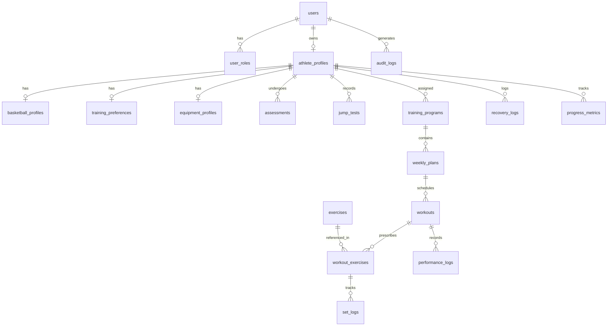

# VERTEX - Database Schema & Data Models Specification

Version: 2.1 (Phase 0 & 1 Baseline)

---

## 1. Persistence & Migration Rules

1. **Single Source of Truth**: PostgreSQL 16+ is the authoritative relational store.
2. **Schema Management**: Managed strictly through Flyway migrations under `src/main/resources/db/migration/`. All migration files are named `V<version>__<description>.sql`.
3. **Primary Keys & Types**:
   - Primary Keys: UUID (`gen_random_uuid()` / `UUIDv4`) for distributed uniqueness and security against enumeration.
   - Foreign Keys: Strongly enforced with appropriate index coverage.
   - Timestamps: Always `TIMESTAMPTZ` (UTC).
4. **Auditability**: Critical state transitions record `created_at`, `updated_at`, `created_by`, and `version` columns.

---

## 2. Core Entity-Relationship Diagram (Relational Blueprint)

---

## 3. Flyway Migration Sequencing

| Migration Version | Description | Included Entities |
| :--- | :--- | :--- |
| `V1__init_schema.sql` | Core identity, roles, audit trail & feature flags | `users`, `roles`, `user_roles`, `refresh_tokens`, `audit_logs`, `feature_flags` |
| `V2__athlete_journey.sql` | Athlete profile, basketball, training, equipment, safety & jump tests | `athlete_profiles`, `athlete_goals`, `basketball_profiles`, `training_preferences`, `equipment_profiles`, `assessments`, `jump_tests` |
| `V3__training_engine.sql` | Exercises, rules, programs, workouts, logs & recovery | `exercises`, `exercise_categories`, `training_rules`, `training_programs`, `training_phases`, `weekly_plans`, `workouts`, `workout_exercises`, `set_logs`, `performance_logs`, `recovery_logs` |
| `V4__ai_and_coach.sql` | AI reports, recommendations, coach relationships & notifications | `ai_reports`, `ai_recommendations`, `coach_profiles`, `coach_athletes`, `notifications`, `video_metadata` |

---

## 4. Phase 1 Initial Schema Tables (`V1__init_schema.sql`)

### `users`
- `id` (UUID, PK)
- `email` (VARCHAR(255), UNIQUE, NOT NULL)
- `password_hash` (VARCHAR(255), NOT NULL)
- `first_name` (VARCHAR(100), NOT NULL)
- `last_name` (VARCHAR(100), NOT NULL)
- `is_active` (BOOLEAN, DEFAULT TRUE)
- `is_email_verified` (BOOLEAN, DEFAULT FALSE)
- `created_at` (TIMESTAMPTZ, NOT NULL, DEFAULT NOW())
- `updated_at` (TIMESTAMPTZ, NOT NULL, DEFAULT NOW())

### `roles` & `user_roles`
- Standard RBAC (`ROLE_ATHLETE`, `ROLE_COACH`, `ROLE_ADMIN`).

### `refresh_tokens`
- `id` (UUID, PK)
- `user_id` (UUID, FK -> users(id))
- `token_hash` (VARCHAR(255), UNIQUE, NOT NULL)
- `expires_at` (TIMESTAMPTZ, NOT NULL)
- `revoked_at` (TIMESTAMPTZ)
- `created_at` (TIMESTAMPTZ, NOT NULL)

### `audit_logs`
- `id` (UUID, PK)
- `actor_id` (UUID, NULLABLE -> users(id))
- `action` (VARCHAR(100), NOT NULL)
- `resource_type` (VARCHAR(100), NOT NULL)
- `resource_id` (VARCHAR(255))
- `ip_address` (VARCHAR(45))
- `user_agent` (VARCHAR(255))
- `details` (JSONB)
- `created_at` (TIMESTAMPTZ, NOT NULL, DEFAULT NOW())

### `feature_flags`
- `id` (UUID, PK)
- `key` (VARCHAR(100), UNIQUE, NOT NULL)
- `description` (TEXT)
- `is_enabled` (BOOLEAN, DEFAULT FALSE)
- `created_at` (TIMESTAMPTZ, NOT NULL, DEFAULT NOW())
- `updated_at` (TIMESTAMPTZ, NOT NULL, DEFAULT NOW())
